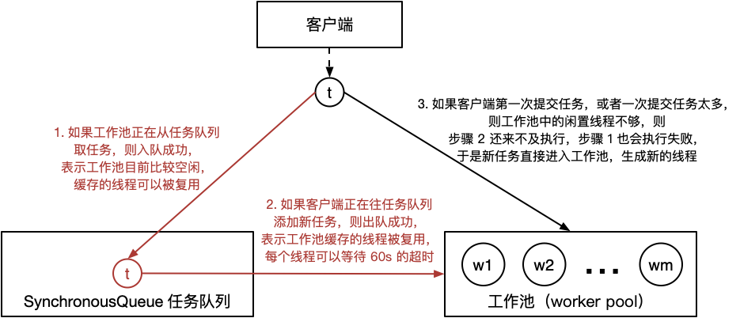

<a name="index">**目录**</a>

- <a href="#ch1">**1 方法定义**</a>
- <a href="#ch2">**2 疑问**</a>
- <a href="#ch3">**3 ThreadPoolExecutor.execute() 方法核心代码**</a>
- <a href="#ch4">**4 关键点: 线程存活时间 keepAliveTime**</a>
- <a href="#ch5">**5 两个关键方法**</a>
- <a href="#ch6">**6 流程总结**</a>
- <a href="#ch7">**7 newCachedThreadPool 适用场景**</a>

<br>
<br>

### <a name="ch1">1 方法定义</a><a style="float:right;text-decoration:none;" href="#index">[Top]</a>

`CachedThreadPool` 的定义如下：

```java
public static ExecutorService newCachedThreadPool() {
    return new ThreadPoolExecutor(0, Integer.MAX_VALUE,
                                  60L, TimeUnit.SECONDS,
                                  new SynchronousQueue<Runnable>());
}
```

定义说明：

- 核心线程数（corePoolSize）设置为 0，说明完成尝试清理过程后，工作池不会再持有线程资源；
- 最大线程数（maximumPoolSize）设置为无穷大，说明理论上工作池中可以缓存的线程上限；
- 线程存活时间（keepAliveTime）设置为 60 秒，这是第一个关键点，稍后说明；
- SynchronousQueue 阻塞队列是一个最大容量为 1 的队列，如果没有元素出队则不能入队，如果没有元素入队则不能出队，也就是说必须同时出队和入队，才能成功操作，这是第二个关键点。

<br>
<br>

### <a name="ch2">2 疑问</a><a style="float:right;text-decoration:none;" href="#index">[Top]</a>

粗一看，这样设置后，工作池似乎不能缓存线程，理由如下：

- 新提交任务后，由于核心线程数限制，只能插入任务队列缓存；
- 而 SynchronousQueue 队列的性质决定单独入队一个任务不能成功；
- ThreadPoolExecutor 于是生成新的线程执行此任务；
- 根据之前[ThreadPoolExecutor 的原理](https://github.com/huanzhiyazi/articles/issues/5)分析，任务执行完后，线程将从任务队列 SynchronousQueue 中获取缓存的任务，但是 SynchronousQueue 不能缓存任务，那么线程将终止，即便不终止，也因为取不到缓存任务而成为一个无用线程，缓存的线程又有什么用呢？

<br>
<br>

### <a name="ch3">3 ThreadPoolExecutor.execute() 方法核心代码</a><a style="float:right;text-decoration:none;" href="#index">[Top]</a>

```java
public void execute(Runnable command) {
    if (command == null)
        throw new NullPointerException();

    int c = ctl.get();

    // a路径：核心线程数为 0，此处不会执行
    if (workerCountOf(c) < corePoolSize) {
        if (addWorker(command, true))
            return;
        c = ctl.get();
    }

    // b路径：初始提交任务，SynchronousQueue 入队失败，若有缓存线程正在取任务，则入队成功
    if (isRunning(c) && workQueue.offer(command)) { 
        // offer 的任务如果成功，应该会马上被 getTask() 中的缓存线程 poll() 走，
        // 所以这里的 addWorker() 应该不会被执行到
        int recheck = ctl.get();
        if (! isRunning(recheck) && remove(command))
            reject(command);
        else if (workerCountOf(recheck) == 0)
            addWorker(null, false);
    }

    // c路径：初始提交任务将在此处生成新的线程执行
    else if (!addWorker(command, false)) 
        reject(command);
}
```

<br>
<br>

### <a name="ch4">4 关键点: 线程存活时间 keepAliveTime</a><a style="float:right;text-decoration:none;" href="#index">[Top]</a>

`keepAliveTime` 给 `SynchronousQueue` 缓存任务提供了一个缓冲时间：

- 注意到，在 newCachedThreadPool 中，每个线程的存活时间设置为了 60s；
- 此生存时间不并不包括任务执行时间，而是执行完任务后，线程从阻塞队列中取缓存任务的等待时间；
- 若在等待时间内队列中有新入队的任务，则可以成功取出，在当前线程中继续执行该任务，而不用重新生成新的线程；
- 若超时还未有新的任务入队，则线程会进入终止状态，释放资源；
- 所以，工作池中每个线程在执行完任务后，从 SynchronousQueue 中取缓存任务不是立即返回的，而是有一个 60s 的超时等待，只要在 60s 内有新的任务入队，则可以成功取出任务继续复用缓存的线程，此处新提交的任务将进入 execute() 方法中的 `b路径`。

<br>
<br>

### <a name="ch5">5 两个关键方法</a><a style="float:right;text-decoration:none;" href="#index">[Top]</a>

第一个关键方法是工作池中的线程执行任务的方法——runWorker()

```java
final void runWorker(Worker w) {
    // 此处省略初始化代码

    try {
        // 若执行完第一个任务，则通过 getTask() 从队列中取缓存任务，若取到则执行，线程被复用
        while (task != null || (task = getTask()) != null) { 
            // 此处省略任务执行代码
        }
        // 省略
    } finally {
        // 任务队列取不到任务，进入尝试清理阶段
        processWorkerExit(w, completedAbruptly); 
    }
}
```

第二个关键方法是工作池从任务队列中取缓存任务的方法——getTask()

```java
private Runnable getTask() {
    boolean timedOut = false; // Did the last poll() time out?

    for (;;) {
        // 省略初始化和线程池状态迁移代码

        int wc = workerCountOf(c);

        // 标记需要超时等待 timed == true
        boolean timed = allowCoreThreadTimeOut || wc > corePoolSize; 

        // 省略工作池满提前退出代码

        try {
            Runnable r = timed ?
                // 任务执行完，60s 等待从 SynchronousQueue 中取任务
                workQueue.poll(keepAliveTime, TimeUnit.NANOSECONDS) : 
                workQueue.take();
            if (r != null)
                return r;
            timedOut = true;
        } catch (InterruptedException retry) {
            timedOut = false;
        }
    }
}
```

<br>
<br>

### <a name="ch6">6 流程总结</a><a style="float:right;text-decoration:none;" href="#index">[Top]</a>

以下是 CachedThreadPool 运行机制的结构图，可以大概描述其运行流程：



这里需要注意的是，如果客户端一次提交的任务太多，则工作池中没有足够的闲置线程来从任务队列中 poll 缓存任务，也就是说，客户端提交的任务里只有一部分可以在任务队列中插入成功，剩下的任务全部直接进入工作池中，并生成新的线程来执行。

<br>
<br>

### <a name="ch7">7 newCachedThreadPool 适用场景</a><a style="float:right;text-decoration:none;" href="#index">[Top]</a>

CachedThreadPool 适合大量短时间任务并发执行，因为：

- 短任务快速执行完，可以让缓存的线程快速腾出接受新的任务，缓存线程利用率高；
- CachedThreadPool 可以自适应任务提交速度的变化，如果提交变快，没有缓存线程可用，则新生成线程扩大工作池规模，若提交变慢，缓存线程可以被重用，冗余的线程可以终止，缩小工作池规模；

同时，CachedThreadPool 不适合长时间执行的任务，因为长任务会长期占用当前线程，当前线程难以被及时派去任务队列取下一个任务，新提交的任务总是无法插入到任务队列，从而不得不总是生成新的线程来执行，线程复用率过低。此时若同时运行的线程数过多，又会增加线程创建和切换开销，严重影响性能。


