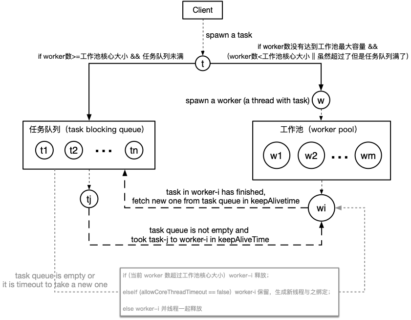

<a name="index">**目录**</a>

- <a href="#ch1">**1 Java 线程池家族**</a>

<br>
<br>

### <a name="ch1">1 Java 线程池家族</a><a style="float:right;text-decoration:none;" href="#index">[Top]</a>

Java 线程池主要有三类：```ThreadPoolExecutor```，```ScheduledThreadPoolExecutor```，```ForkJoinPool```。
其中 ```ScheduledThreadPoolExecutor``` 在 ```ThreadPoolExecutor``` 的基础上组合了线程调度功能（按照延迟时间排队进行延迟调度，周期调度）。所以总的来说只有两大类线程池：```ThreadPoolExecutor``` 和 ```ForkJoinPool```。

ForkJoinPool 用的不多，以后可能会去研究一下，这里主要说一下 ```ThreadPoolExecutor```的原理。

<br>
<br>

### <a name="ch2">2 ThreadPoolExecutor 的线程池模型</a><a style="float:right;text-decoration:none;" href="#index">[Top]</a>

ThreadPoolExecutor 是一个基于生产者-消费者模型的结构，如下图所示：



我们具体说明一下：

- **任务（task）**：一个可在线程中执行的实体，在 Java 即为 Runnable。

- **生产者**：客户端（Client），任务队列（task blocking queue）。其功能是给工作池提供需要执行的任务。

- **消费者**：工作池（worker pool）。其功能是从生产者获取任务并执行。

- **客户端** 不定期或定期向任务队列或直接向工作池提交新的任务，提交给谁取决于工作池的繁忙程度。

- **工作池** 是一个运行的线程集合，可运行一个或者同时运行多个并发线程。根据机器的性能和任务执行要求，一般会事先给工作池设定一个核心大小（corePoolSize），核心大小表示在维持系统最佳运行情况的前提下可以同时执行的线程数量。一般将 corePoolSize 设定为机器的 CPU 核数。

- **任务队列** 是一个多线程共享阻塞队列，是线程安全的。在工作池比较繁忙的时候，用于缓存即将执行的任务。

- **客户端的行为**：当工作池中运行的任务数小于 corePoolSize 时，表示工作池此时比较空闲，客户端新提交的任务直接提交给工作池立即运行；否则，表示工作池处于繁忙状态，需要将任务提交给任务队列排队等候；任务队列如果是有界的，则任务队列也可能满了，这时候新任务仍然提交给工作池，此时表示任务执行已经非常繁忙了，这样的情况可能一直持续到工作池也放不下新任务为止，这时任务直接返回失败。

- **工作池的行为**：工作池中任意一个 worker（图中假设为 worker-i）完成其任务后，会马上向任务队列请求新的任务。在任务队列返回新任务之前，worker-i 中的闲置线程有一个存活时间——keepAliveTime。只要在 keepAliveTime 时间内返回一个新的任务，则继续在当前线程中执行；否则，可能因为任务队列已空或者其它原因导致返回失败，工作池意识到所有任务可能已经执行结束了，会进行一个尝试清理过程。

- **工作池尝试清理**：该过程如图底部的灰色部分。首先，如果工作池中的 worker 数超过了 corePoolSize，说明工作池规模需要收缩，并一直缩小到 corePoolSize 为止；接下来，需要决定是否将 剩下的 corePoolSize 个 worker 也进行清理，这取决于另一个参数——allowCoreThreadTimeout，表示是否允许核心线程超时，如果允许，说明没有任务执行的情况下，线程是可以无限制等待的，换句话说，工作池中可以不用缓存线程，这时候将清除工作池中所有的闲置线程。默认情况下，是不允许的，也就是说，ThreadPoolExecutor 在设计的时候，就假定线程池是一个持续运行实体，可以缓存一定数量的线程，只要任务到来就可以马上执行，而不用重新生成新的线程。

<br>
<br>

### <a name="ch3">3 线程池的关闭</a><a style="float:right;text-decoration:none;" href="#index">[Top]</a>

如果确定线程池不再需要运行了，可以手动关闭线程池——shutdown()。关闭线程池主要执行以下两步：

1. 将线程池的状态设定为关闭状态——SHUTDOWN。
2. 将工作池中还未运行结束的线程进行中断处理——interrupt，线程中的任务可以根据中断状态各自处理任务中断，避免无效执行。

第一步是关键，因为在工作池尝试清理阶段，如果线程池的状态已经是 SHUTDOWN 了，各个 worker 将不会再产生新的线程，相当于使 allowCoreThreadTimeout 参数无效。

以上说明，如果任务队列中还有任务未完成，则工作池尝试清理过程不会执行，也就不会 care SHUTDOWN 状态标记了，这时候线程池将继续执行完任务队列中的任务，直到进入工作池尝试清理阶段，才会真正执行清理过程。这是一个优雅的关闭流程，因为这样的关闭相当于只是给线程池发送一个关闭通知，线程池可以获知接下来不会再有新任务产生了，可以放心执行完已经提交但还缓存的任务，执行完后就可以 over 了。

如果我们认为缓存的任务也并不重要，我们确实需要线程池尽快结束运行并清理，那么也是可以的。ThreadPoolExecutor 还提供了一个粗暴关闭手段——shutdownNow()，给我立马结束运行！！

shutdownDown() 实际上之比 shutdown() 多执行了一个关键步骤——清空任务队列。这样线程池在执行完工作池中的任务后，会提前进入到 工作池尝试清理阶段，比 shutdown() 更快地结束运行。

<br>
<br>

### <a name="ch4">4 关于ScheduledThreadPoolExecutor的一点说明</a><a style="float:right;text-decoration:none;" href="#index">[Top]</a>

ScheduledThreadPoolExecutor 的核心仍然是 ThreadPoolExecutor，它实现调度功能的关键在于其独特的任务队列。与通常的 FIFO 链式任务队列不同，ScheduledThreadPoolExecutor 采用的是带时间参数的小顶堆作为任务队列。这样在工作池每次从任务队列中取下一个任务时，将按照小顶堆的工作方式获取最小延迟任务。

后续我们还将看到，因为采用的任务队列不同而实现的特定线程池——CachedThreadPool。我将单独写一篇关于 CachedThreadPool 原理的文章。


