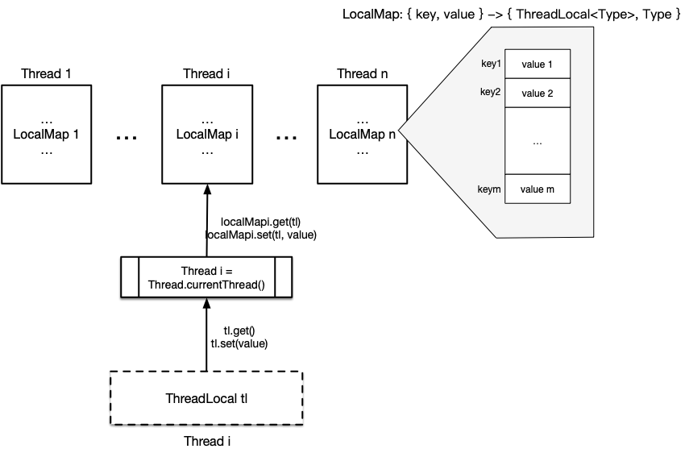

<a name="index">**目录**</a>

- <a href="#ch1">**1 预备知识——斐波拉契散列**</a>

<br>
<br>

### <a name="ch1">1 预备知识——斐波拉契散列</a><a style="float:right;text-decoration:none;" href="#index">[Top]</a>

Java ThreadLocal 的作用是在当前线程维护一块线程独立（除了本线程外，其它线程无法访问到）的数据区来规避并发问题。其中为了实现对线程独立数据区的快速访问，ThreadLocal 将这块数据区保存在一个散列表中。我们暂且将该散列表叫做 **ThreadLocal散列表**。

ThreadLocal散列表采用 **斐波拉契散列** 方法实现散列函数。

具体而言，ThreadLocal散列方法用 **黄金分割比魔数（0x61c88647）** 作为散列乘数，以如下公式作为散列函数以实现最大程度减少冲突的目的：

```
hash(K) = (K * 0x61c88647) & (hashtable.len - 1)
```

其具体的散列原理可以参考 [斐波拉契散列](https://github.com/huanzhiyazi/articles/issues/17)。

<br>
<br>

### <a name="ch2">2 ThreadLocal 核心结构</a><a style="float:right;text-decoration:none;" href="#index">[Top]</a>

上一节讲到，ThreadLocal 在当前线程维护了一个散列表，而这个散列表只能由当前线程自己访问，以此来避免该散列表内的数据并发问题。所以 ThreadLocal 基本的结构图如下：



如图所示，关键点如下：

- **每一个 Java Thread 对象都保存一个散列表——LocalMap**。实际定义如下：

```java
public
class Thread implements Runnable {
    // ...省略

    /* ThreadLocal values pertaining to this thread. This map is maintained
     * by the ThreadLocal class. */
    ThreadLocal.ThreadLocalMap threadLocals = null; // 图中的 LocalMap

    // ...省略
}
```

LocalMap 的实际维护者为 ThreadLocal。

- **应用程序通过 ThreadLocal 确保只访问当前线程的 LocalMap**。这包含两层意思：

    1. ThreadLocal 只访问当前线程的 LocalMap。这实际由 `Thread.currentThread()` 这个静态方法来保证。比如，在 ThreadLocal.get() 方法中，先通过 Thread.currentThread() 得到当前 Thread 对象，然后再读该对象中的 LocalMap 散列表：
    
    ```java
    public T get() {
        Thread t = Thread.currentThread();
        ThreadLocalMap map = getMap(t);

        // ...从 map 中读并返回值
    }
    ```

    2. 如果不通过 ThreadLocal 也能引用到其它线程的 LocalMap。但是除非用反射，否则虽然有其它线程的 LocalMap 引用，但是却无法访问它。因为 LocalMap 中的所有方法都是私有的，只有外部类 ThreadLocal 有权限访问它们。

有了这个保证，如果有数据不希望被其它线程看到，就可以放心通过 ThreadLocal 存入 LocalMap 散列表。**它的效果类似于一个局部变量（local parameter），都只对当前线程可见；只不过一般来说，其生命周期要长于局部变量，可访问范围也要大于局部变量**。

- **每一个 ThreadLocal 对象都是散列表中的一个键（key）**。键值从 1 开始递增，并通过以下散列函数映射到散列表中的索引位置：

```
hash(key) = (key * 黄金分割比魔数) & (散列表长度 -1)
```


<br>
<br>

### <a name="ch3">3 ThreadLocal 散列表读写</a><a style="float:right;text-decoration:none;" href="#index">[Top]</a>

LocalMap 是一个数组，根据斐波拉契散列原理，其长度必须是 2 的倍数。LocalMap 的读写需要解决三个关键问题：**清理、冲突、扩容**。

#### <a name="ch3.1">3.1 散列表的清理</a>

LocalMap 中的元素是可被系统回收的，这样可以避免不再使用的对象长期滞留在散列表中占用内存空间。其散列表的定义如下：

```java
static class ThreadLocalMap {

    // 散列表元素，是一个弱引用，本质是 ThreadLocal 是一个弱引用
    static class Entry extends WeakReference<ThreadLocal<?>> {
        /** The value associated with this ThreadLocal. */
        Object value;

        Entry(ThreadLocal<?> k, Object v) {
            super(k);
            value = v;
        }
    }

    // 散列数组
    private Entry[] table;

    // ...省略
}
```

可以想象这样一种情况，外部应用程序先生成了一个 ThreadLocal 对象，并保存在当前线程的散列表中。当外部应用程序不再用到该 ThreadLocal 对象时，将解除其引用（即设置成 null），其本意是要告诉 JVM，该对象可以被回收了。此时，如果 LocalMap 中仍然持有对该对象的强引用，则该对象虽然不再被使用，但是永远得不到回收的机会了，从而会导致内存泄露。所以散列表中对 ThreadLocal 的引用必须是 WeakReference 的，这样 JVM 才有机会释放它。

LocalMap 的清理过程是在读写 LocalMap 时进行的，如图所示：


