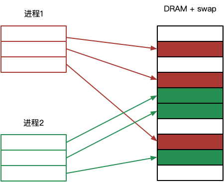
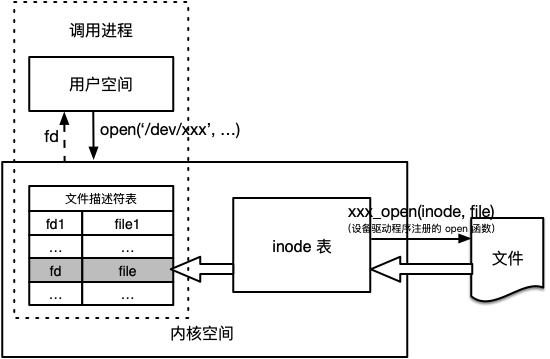
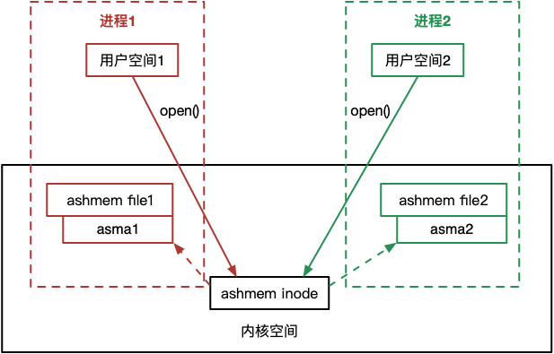

- <a href="#ch1">**1 进程间通信之共享内存**</a>
- <a href="#ch2">**2 Linux POSIX 共享内存接口 shm_open**</a>
- <a href="#ch3">**3 Android ashmem 共享内存原理**</a>

<br>
<br>

### <a name="ch1">1 进程间通信之共享内存</a><a style="float:right;text-decoration:none;" href="#index">[Top]</a>

Android 匿名共享内存————ashmem，其本质是一种共享内存实现方案，而共享内存是操作系统实现进程间通信（IPC）的一种手段。众所周知，binder 驱动是 Android 运用最广泛的一种 IPC，那么为什么还需要 ashmem 呢？我们将在文章最后给出答案，在此之前，我们将其作为一种共享内存机制来说明其实现原理。

本节我们先复习一下共享内存的原理。

#### <a name="ch1.1">1.1 什么是虚拟内存</a>

虚拟内存————vm 不是一块实际存在的内存，为了缓解物理内存不够用的问题，往往从磁盘空间中开辟一块空间作为物理内存的扩展，这块开辟的磁盘空间被称为交换区——swap。

但是我们知道，CPU 是不能直接访问磁盘空间的，所有的数据都必须先从磁盘空间读入物理内存之后才能被 CPU 访问。所以 swap 的工作方式并不是简单地当物理内存用完之后直接从交换 区读取数据，而是有一个换出（swap out）换入（swap in）的过程。

具体来说，根据局部访问原理，我们总是认为物理内存中存储的总是最近最常访问的数据，所以当我们要访问数据时，大多数时候可以直接从物理内存中访问到。但是，当访问数据不在物理内存中时，内核需要将数据从磁盘载入物理内存（换入），同时将最近最不常使用的数据从内存中暂存到磁盘交换区以留出足够的空间来存储换入的数据（换出）。

这样，即使我们需要运行的程序和数据量超过了物理内存的上限，但是我们仍然感觉内存空间比实际物理内存要大，而这块更大的内存并不是因为实际物理内存有这么大，而是通过动态的换入换出过程虚拟出来的。由于实际不是一块真实的内存，所以将其称为虚拟空间更为合适，这个虚拟空间的大小为：

```
vm = 物理内存 + swap
```

对于进程来说，它能看到的是虚拟空间，所以虚拟空间需要进行统一编址。一个进程在访问一个虚拟内存页的时候，实际是要去访问其对应的物理内存页，所以虚拟地址和物理地址之间需要一张映射表去根据虚拟地址查找到对应的物理地址，这个工作由内存管理单元————MMU（一般集成在 CPU 中）来完成。如果 MMU 映射到的物理页面存在，则直接访问，否则触发缺页中断，需要启动磁盘执行换入换出操作，重新建立该页的映射关系。


#### <a name="ch1.2">1.2 什么是内存共享</a>

通常情况下，各个进程的内存空间是相互独立的，这不光是指其虚拟空间独立，同时也意味着其对应的物理空间也是独立的。这样，一个进程是不能访问到另外一个进程的内存空间的，如下图所示：



为了简单起见，图中省略了 MMU 部分，且我们把物理空间统一标识为 DRAM+swap，即物理内存和交换区，隐藏不必要的缺页细节。

若两个进程需要通过内存共享来实现 IPC，那么两个进程的虚拟空间仍然是独立的，而物理空间则出现了重叠，即来自两个进程不同的虚拟页面共同指向了物理空间的同一个页面，如下图所示：


这样一来，v1 和 v2 两个页面共同指向了物理空间的 p 页面，当进程1往 v1 中写入数据的时候，实际就是往 p 写入数据，而进程2从 v2 中读到的即是 p 中的数据，即刚刚进程1写入的数据，反过来也一样。这样便实现了共享内存 IPC。

像这种共享的物理 p 页面，根据应用的不同，有两种指代：一是指相同的只读数据，比如两个不同的进程都从磁盘载入相同的可运行代码，为了节省内存，在物理空间只需要维护一个副本；二是手动创建一个新的内存映射，将同一部分物理页面分别映射到不同进程的虚拟空间中，其核心的实现往往需要借助 mmap 系统调用来完成（我们只讨论 POSIX 的实现，对于 System V 有不同的共享内存实现，但是原理差不多），而这才是共享内存最广泛的应用。

#### <a name="ch1.3">1.3 基于 mmap 实现的内存共享</a>

mmap 系统调用将创建一个物理空间与调用进程虚拟空间之间的新映射。我们先看一下 mmap 的函数定义：

```c
void *mmap(
    void* addr, 
    size_t length, 
    int prot, 
    int flags, 
    int fd, 
    off_t offset
);
```

- addr 参数指定映射被放置的虚拟地址，实际上内核只将其作为参考，尽可能的进行匹配，可以传 NULL 完全由内核决定。
- length 参数指定了映射的字节数，会被向上提升为一个分页大小的下一个倍数，因为映射大小是以页作为单元的。
- prot 参数是一个位掩码组合（用 OR 组合），指定了映射上的保护信息（可读、可写、可执行）。
- flags 参数是映射控制码。若为 MAP_PRIVATE 表示私有映射，映射只发生在当前进程中，变更只对当前进程可见，对于文件映射，变更也不会修改相应的底层文件；若为 MAP_SHARED 表示共享映射，即对相同映射都设置了 MAP_SHARED 的不同进程，变更对所有进程都是可见的，对于文件映射，其变更将反映到底层文件；若为 MAP_ANONYMOUS 表示匿名映射。
- fd 参数表示文件描述符，如果需要将一个文件所表示的区域映射到进程虚拟空间时，可以设置一个有效的文件描述符。
- offset 只对于文件映射有效，表示文件映射区域的起始位置。

mmap 系统调用成功后，将返回新映射的起始虚拟地址。

我们把基于 mmap 实现共享内存的讨论范围进行一下约定：

1. 由于 MAP_PRIVATE 私有映射往往用于内存分配场景，不具备共享内存的功能，所以我们只考虑 MAP_SHARED 共享映射。
2. 另外 linux 自带的匿名映射会忽略 fd 参数，此时 fd 可以设置为 -1，那么基于 MAP_SHARED|MAP_ANONYMOUS 和 fd=-1 就可以实现匿名共享内存。但是这样的共享内存只限定在具有继承关系的相关进程之间。比如父进程通过 mmap 返回一个匿名共享内存映射地址，然后通过 fork 系统调用产生一个子进程，子进程将继承父进程的映射地址，由此可以实现父子进程间的内存共享。而我们的讨论不仅仅限制在相关进程之间，所以 linux 原生基于 mmap 的匿名共享内存也不加以深究。

**以上，我们只讨论基于 mmap 的共享（MAP_SHARED）文件映射。**

在讨论共享文件映射之前，我们先简单理解一下 Linux 下的设备，因为我们这里讨论的文件，都是依赖于具体的设备的。

- **Linux 设备**

Linux 下有两种类型的设备：字符设备和块设备。字符设备每次只能处理一个字符，比如终端和键盘；块设备每次处理一块数据，比如磁盘设备。另外，设备可以是实际存在的物理实体设备，也可以是虚拟出来的设备，对于操作系统来说，不管是实体设备还是虚拟设备都提供统一的设备处理接口，都是抽象的设备。

在 Linux 下，一切皆文件，于上层来说，简化了接口，隐藏了细节。设备也不例外，每个设备都被抽象成一个文件，叫做设备文件。每个设备都对应 /dev 目录下的一个文件节点，且都有一个主设备号和次设备号。主设备号相同的设备（文件），通常使用相同的驱动程序来处理对设备的 I/O 请求，这些驱动程序都有对应的系统调用（比如 open()、close()、read()、write()、mmap()以及 ioctl()）。

举个例子，比如主设备号为 8 的设备是 SCSI磁盘设备，而磁盘设备根据分区又分为很多子设备，其文件名均以 /dev/sd** 开头，每个子设备都通过不同的次设备号来区分。那么当对一个普通文件进行 open、read、mmap 等操作时，最终都关联到主设备号为 8 的设备驱动程序来处理。

在系统初始化的时候，每个设备都会被注册进内核，同时设置该设备的驱动程序。此外，内核中有一张常驻的 inode 表，里面记录了所有已创建文件的基本信息和索引信息，每个文件对应一个 inode 结构。就磁盘设备来说，当创建一个普通磁盘文件的时候，会在内核中为该文件增加一个 inode 结构，特别的，会初始化 inode 结构中的属性 i_fop，它是一个 file_operations 结构体，其中记录了所有的设备驱动程序函数。

所以，理论上，对一个文件进行的所有 I/O 操作，都可以定向到该文件在内核中的 inode 结构中指向的其对应设备的驱动程序来处理。这不光适用于普通文件，甚至也适用于设备文件本身，因为设备文件也是一个文件，在内核中也会维护一个 inode 结构。

所以我们看 Linux 下的设备和文件有一个有趣的现象：**设备皆文件，文件隶属于设备**。前者简化设备的操作，后者是文件I/O驱动特点使然。

接下来看一下 mmap 执行文件映射的过程是怎样的：

- **mmap 执行文件映射过程**

**1. 执行 open 系统调用**，打开一个文件，初始化一个与该文件相关联的 file 结构体以及指向该结构体的文件描述符 fd，fd 和 file 作为调用进程文件描述符表的一个新项被插入。



几个要点：

open 的作用就是根据 inode 表初始化文件的一个 file 结构体，然后将其记录在内核为该进程维护的文件描述符表中，而用于索引 file 的文件描述符 fd 则由进程用户空间维护。

file 表示一个打开的文件，里面记录的信息是动态的，比如读写位置变化等；inode 表示一个文件的基本信息，是静态不变的。

值得注意的是，file 中也有一个 file_operations 的属性 f_op，是基于 inode 中的 i_fop 初始化的，所以打开后的文件，执行后续的 I/O 操作都可以直接通过 file 中的 f_op 定向到其对应的设备驱动函数了，比如 mmap。

**2. 执行 mmap 系统调用**，在调用进程用户空间中开辟一块指定大小的虚拟内存块 vma，并将 vma 与上一步打开的文件进行关联，即将文件指定区域映射到虚拟空间中。


从图中可以看到，mmap 只是简单的将虚拟空间和文件指定区域建立了对应关系，这在逻辑上表示以后可以像读写虚拟内存 vma 一样读写文件中的指定区域。但是实际上，还并没有为文件上该块区域分配相应的物理内存。

在 Linux 中，给进程分配的虚拟空间 vma 由 vm_area_struct 结构体来表示，该结构体中有一个成员属性 vm_file，它指向的就是被映射的文件的 file 结构。

逻辑上来讲，mmap 系统调用完成三个步骤：

a. 根据要映射的空间大小创建并初始化虚拟内存结构 vma，表示分配了一块虚拟内存。
b. 根据传递给 mmap 的 fd 从当前进程的文件描述符表中找到对应的 file 结构体。
c. 调用 file->f_op->mmap(file*, struct vm_area_struct*) 定向到 mmap 驱动函数完成映射过程。

而驱动函数 mmap(file*, struct vm_area_struct*) 的主要任务就是把一个 **合适的文件** 指定到 vma->vm_file 上，以完成映射。为什么说是合适的文件呢？因为实际映射的文件有可能是系统调用 mmap 中传递的 fd 指向的文件（如普通磁盘文件）；而对于某些设备文件往往不是直接映射为该设备文件，因为这些设备文件可能并不具备直接存取数据的能力，而是会单独映射到一个新建的可进行存取的文件中，比如从内存文件系统 tmpfs 中申请一个文件。而 Android 匿名共享内存恰好就是采取的第二种映射方案，我们将在后面详细描述。

既然 mmap 并没有为映射文件分配物理内存，那么如何对映射的文件区域进行访问呢？这就要用到 1.1 节中提到的 MMU 转义和缺页中断机制了：


如图所示，mmap 会返回虚拟空间的起始地址 addr，这实际也是分配的 vma 链表中的第一个 vma 块的起始地址，即 vma->vm_start。对于调用进程而言，可以直接往 addr 指向的虚拟空间进行读写，而不用通过 read/write 系统调用来读写映射的文件了。

- 首先，向 addr 指向的虚拟空间读写数据。
- 由 MMU 将 addr 转义成具体的物理地址，但是因为没有为文件分配物理空间，无法找到对应的物理地址，发生缺页，调用缺页中断程序。
- 缺页中断先试图从 swap 中寻找对应的页面，如果找到，说明文件被载入过且因为其它页的换入操作被换出过了，于是直接从 swap 中换入缺失的页面到物理内存。
- 若 swap 中也没有对应的页面，说明文件从未被载入过，于是从磁盘空间载入指定文件的区域到物理内存。
- 返回物理内存地址，实现虚拟页到物理页的映射关系。

以上，缺页发生后无论是从个 swap 中载入缺页还是从文件中载入缺页，物理内存都可能已满，这时缺页机制会执行换出操作，将其它最近最不常使用的页面换出到 swap 区。

<br>

到目前为止，我们已经知道了 mmap 实现共享文件映射的过程，只不过只分析了一个进程在共享模式下映射一个文件的原理，那么要实现两个进程的内存共享，我们也不难分析其过程：

1. 假设要映射的文件名为 fname，一般是一个路径，共享区域大小为 len。
2. 进程1 对文件执行 open 和 mmap 系统调用：

```c
int fd1 = open(fname, ...);
void* addr1 = mmap(NULL, len, ..., MAP_SHARED, fd1, 0);
```

3. 进程2 同样对文件执行 open 和 mmap 系统调用：

```c
int fd2 = open(fname, ...);
void* addr2 = mmap(NULL, len, ..., MAP_SHARED, fd2, 0);
```

这样，进程1 中的 addr1 表示的虚拟地址和进程2 中的 addr2 表示的虚拟地址都指向了一块相同的物理内存区域，于是便实现了进程1 和进程2 的内存共享。

需要特别注意的是，进程1 打开文件返回的文件描述符 fd1 只对进程1 有效，而不能直接给进程2 使用，因为不同的进程都有自己独立的文件描述符表。在进程1 中，open 之后，会给进程1 的文件描述符表中分配一个表项，并生成一个可用的文件描述符 fd1，然后指向文件结构体 file。这时，进程2 中如果没有打开过 fname，则其文件描述符表中根本还没有 fname 的表项，还没有为其分配可用的文件描述符，如果直接把 fd1 拿过来用要么找不到 fname 的 file 结构体，要么找到的根本不是 fname 的 file 结构体，从而产生不可预知的错误。这就是为什么在进程2 中也需要对 fname 先执行一遍 open 调用了。

<br>
<br>

### <a name="ch2">2 Linux POSIX 共享内存接口 shm_open</a><a style="float:right;text-decoration:none;" href="#index">[Top]</a>

在 Linux POXIS 标准中有一个专用的共享内存函数：shm_open()。如果我们使用共享内存进行 IPC 时没有数据持久化的需求，则可以用 shm_open 来实现共享内存。实际上 shm_open 对应的是我们上一节实现共享内存过程的 open 系统调用，所以其实现共享内存的过程也与此类似，即先调用 shm_open 打开一个共享文件并返回文件描述符，然后调用 mmap 完成映射。

通常情况下 shm_open 只是对 open 进行了一下简单的改造，我们看一下它的源码：

```c
int
shm_open (const char *name, int oflag, mode_t mode)
{
  SHM_GET_NAME (EINVAL, -1, "");
  // ... 省略
  int fd = open (shm_name, oflag, mode);
  // ... 省略
  return fd;
}
```

可以看到，内部实际上也是通过系统调用 open 来实现的，其不同之处在于指定打开的文件名是定制的，说明打开的是一个特殊的文件。注意里面的 shm_name 变量，该变量的初始化由宏定义 SHM_GET_NAME 获取，其实际作用就是给参数 name 加上一个共享文件目录的前缀：`/dev/shm/`。

`/dev/shm/` 有何特别之处呢？其表示的实际上是 Linux 的临时文件系统 tmpfs。shm_open 一个文件，相当于就在 tmpfs 文件系统中打开一个文件。

#### <a name="ch2.1">2.1 tmpfs 临时文件系统</a>

tmpfs 从功能上来说，正如其名，即存储在 tmpfs 上的数据都是暂时的、临时的，这意味着它与内存有着相同的特性：临时存储。这样的数据没有持久存储的需求，实际上，tmpfs 文件系统中的数据就是存储在物理内存和 swap 区，它与虚拟空间的物理指向很相似，只不过是以文件系统的方式来管理的。

当在 tmpfs 下创建一个文件后，在该文件上进行读写操作的性能非常高，因为就是直接操作的内存，无需进行 I/O，虽然在物理内存满的时候也需要使用 swap 区进行换入操作，但总体性能还是比直接操作普通文件快很多。

<br>

所以，当我们用 shm_open 实现共享内存的时候，理论上就相当于直接将一块物理内存映射到了进程虚拟空间中，而很多基于内存共享的 IPC 是没有数据持久化的需求的，shm_open 将是一个实现内存共享的首选。

Android ashmem 共享内存的也是基于 tmpfs 文件系统来实现的，与 shm_open 方案有异曲同工之妙。

<br>
<br>

### <a name="ch3">3 Android ashmem 共享内存原理</a><a style="float:right;text-decoration:none;" href="#index">[Top]</a>

到目前为止，我们用大量篇幅分析了 Linux 共享内存原理及相关实现原理，都是为本节分析 Android 匿名共享内存做铺垫，因为 Android 匿名共享内存（ashmem）的底层逻辑与前述 Linux 共享内存的实现原理是一致的，只是在实现细节上结合了一些 Android 框架的特性以及自带锁保护机制实现共享内存的同步访问。

**ashmem 以 mmap 实现共享文件映射，以 tmpfs 临时文件系统作为共享文件，以 binder 驱动作为进程间传递共享文件句柄的桥梁。**

#### <a name="ch3.1">3.1 ashmem设备</a>

**纽带文件**： 在前面分析基于共享文件实现共享内存的时候，文件是一个关键点，先由 open 打开文件，然后再由 mmap 将文件进行映射，两个通信的进程都以同一个文件作为纽带。如前分析，这里的文件既可以是普通的磁盘文件，也可以直接是一个设备文件，但是真正被共享的文件却不一定就是传入的这个文件，传入的文件其主要作用是作为通信进程间的纽带，或者说有了这个纽带文件，进行通信的多个进程就能通过这个纽带文件去找到真正的共享文件。

也就是说，从应用程序的角度看 open 和 mmap 系统调用中的文件名和文件描述符，逻辑上来讲可以将纽带文件当成是共享文件，但从物理层面上看纽带文件不一定是共享文件。

ashmem 中的纽带文件是一个设备，叫 ashmem设备，这是一个虚拟的字符设备，隶属于杂项设备（misc 设备，主设备号为 10），其文件名为 `/dev/ashmem`。Android 系统启动时便会对 ashmem设备进行注册和初始化，在内核 inode 表中将生成该设备的 inode 节点以便后续打开该设备文件所用。以下是其初始化关键代码：

```c
static int __init ashmem_init(void)
{
    int ret;
    ashmem_area_cachep = kmem_cache_create("ashmem_area_cache",
                      sizeof(struct ashmem_area),
                      , , NULL);
    // ...省略

    ret = misc_register(&ashmem_misc);  

    // ...省略  

    return;                                                         
}                                                                     
                                                                      
static struct file_operations ashmem_fops = {
    .owner = THIS_MODULE,
    .open = ashmem_open,
    .mmap = ashmem_mmap, 
    // ...省略
}; 

static struct miscdevice ashmem_misc = {
    .minor = MISC_DYNAMIC_MINOR,
    .name = "ashmem",
    .fops = &ashmem_fops,
};
```

其初始化中我们重点关注两个部分：第一是 ashmem设备的 open 和 mmap 这两个驱动函数，其对应的实现分别是 ashmem_open 和 ashmem_mmap；第二是 ashmem_area_cachep 这个全局变量，其用于分配 ashmem 共享内存，准确的说是一个用于表示 ashmem 共享内存的数据结构，叫做 ashmem_area。ashmem 与上一节描述的 Linux 共享内存在实现上的差异主要就是体现在这两部分。

#### <a name="ch3.1">3.1 ashmem_open</a>

在执行系统调用 `open('/dev/ashmem',...)` 之后，最终会进入到驱动函数 ashmem_open。

ashmem设备的 open 驱动主要完成两件事：

1. 由 ashmem_area_cachep 分配一块 ashmem共享内存 asma，asma 是一个 ashmem_area 结构体，用于描述 ashmem共享内存：

```c
struct ashmem_area {
    char name[ASHMEM_FULL_NAME_LEN]; /* 共享内存名字，记录在 /proc/pid/maps */
    struct list_head unpinned_list; /* 记录所有共享内存块，用于内存管理 */
    struct file *file;        /* 真正的共享文件指针 */
    size_t size;            /* 共享内存大小，字节 */
    unsigned long prot_mask;    /* 控制掩码 */
};
```

当中最重要的一个字段是 file，这个才是 ashmem共享内存中真正的共享文件，从 tmpfs 文件系统分配。

2. 将 asma 记录在设备文件的私有数据字段，这样后续只要能够找到 ashmem设备文件，就能找到 asma 共享内存，就能找到真正的共享文件。

关键代码如下：

```c
static int ashmem_open(
    struct inode *inode, // 表示 ashmem设备文件的 inode 结构体
    struct file *file // 表示 ashmem设备文件的 file 结构体
) {
    struct ashmem_area *asma;

    // ...省略

    // 分配 asma
    asma = kmem_cache_zalloc(ashmem_area_cachep, GFP_KERNEL);

    // ...省略

    // 将 asma 记录在设备文件中
    file->private_data = asma;
    return 0;
}
```

#### <a name="ch3.2">3.2 ashmem_mmap</a>

ashmem设备的 mmap 驱动也主要完成两件事：

1. 向 tmpfs 文件系统申请创建一个共享文件，并记录在 asma 共享内存中。

我们在第 2 节分析 POSIX 共享内存函数 shm_open 的原理的时候知道，可以在 tmpfs 目录（`/dev/shm`）下指定一个文件名来打开并创建一个 tmpfs 文件。即直接执行 shm_open 系统调用即可。不过这种方法返回是共享文件的文件描述符，而这里我们不需要通过文件描述符再去访问文件了，而是直接指定共享文件的 file 结构体就可以了。所以，ashmem_mmap 函数直接调用的 Linux 内核共享文件创建函数 `struct file* shmem_file_setup(const char *name, loff_t size, unsigned long flags)` 来从 tmpfs 文件系统创建一个共享文件，并直接返回共享文件的 file 结构体。

2. 将共享文件映射到 mmap 系统调用分配的虚拟空间中。

我们在 1.3 节中曾经解释过，设备驱动函数 mmap 的一个主要作用就是把一个 **合适的文件** 指定到 vma->vm_file 上，以完成映射。这里，合适的文件便是值得上一步创建的 tmpfs 共享文件。

关键代码如下：

```c
static int ashmem_mmap(
    struct file *file, // ashmem设备文件
    struct vm_area_struct *vma // mmap系统调用分配的虚拟空间
) {
    // 从设备文件取共享内存
    struct ashmem_area *asma = file->private_data;
    int ret = 0;

    // 互斥锁保护
    mutex_lock(&ashmem_mutex);

    // ...省略

    if (!asma->file) { // 共享文件只需要设置一次
        char *name = ASHMEM_NAME_DEF;
        struct file *vmfile;

        if (asma->name[ASHMEM_NAME_PREFIX_LEN] != '\0')
            name = asma->name;

        // 向 tmpfs文件系统申请并创建一个共享文件，asma->size 必须提前通过 ioctl 设置，过程略
        vmfile = shmem_file_setup(name, asma->size, vma->vm_flags);

        // ...省略

        asma->file = vmfile;
    }

    // ...省略

    if (vma->vm_flags & VM_SHARED)
        // 共享文件映射，主要功能是指定 vma->vm_file = asma->file
        shmem_set_file(vma, asma->file);
    else {
        if (vma->vm_file)
            fput(vma->vm_file);
        vma->vm_file = asma->file;
    }
    vma->vm_flags |= VM_CAN_NONLINEAR;

out:
    mutex_unlock(&ashmem_mutex);
    return ret;
}
```

#### <a name="ch3.3">3.3 ashmem设备在进程间的传递</a>

到目前为止，我们已经分析了单个进程如何实现 ashmem文件映射。理论上，根据第 1 节的分析，要实现 ashmem 共享内存，只需要两个进程分别都对 ashmem设备执行一遍 open 和 mmap 系统调用即可。但是 前面我们分析了 ashmem_open 每次调用都会分配一个新的 asma 共享内存，所以如果有两个进程都调用了 `open('/dev/ashmem',...)` 之后，会生成两个设备文件 file 结构体，它们各自拥有独立的 asma 共享内存，也就是说，这两个进程之间根本没有共享内存可言，如下图所示：



其实这样的设置对 Android 系统而言也是合理的，因为我们要实现一个共享内存方案，不光需要有一组进程可以进行共享内存IPC，而且我们需要实现同时有很多进程组的共享内存IPC，每个进程组之间可以通过共享内存实现IPC，且各个进程组之间相互隔离：


所以，我们如何才能实现两个进程间 asma 真正的共享呢？也就是说，当一个服务进程 SP 通过 open 和 mmap 映射了一块 ashmem 共享内存的时候，如何让客户端进程 CP 也从内核中取到由 SP 打开的 ashmem设备文件结构体 ashmem file 呢？

ashmem 在这里是通过 binder 驱动来实现的，其原理如下：


