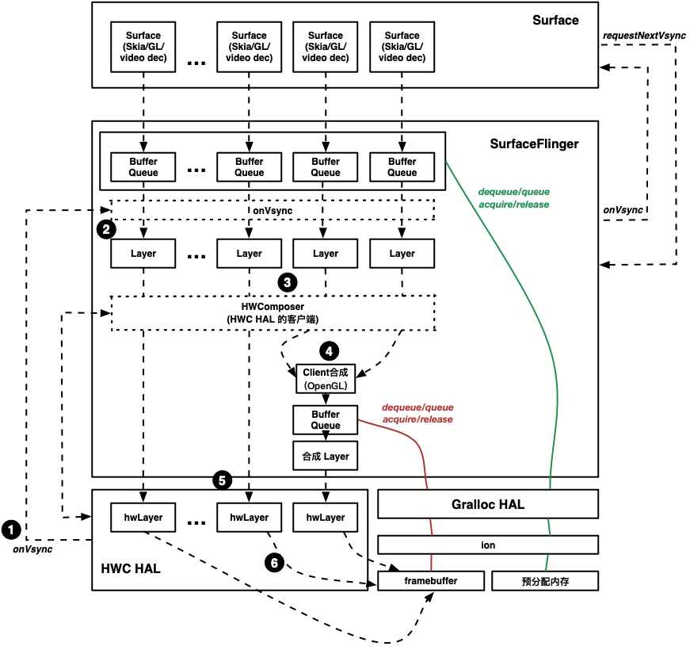

<a name="index">**目录**</a>

- <a href="#ch1">**1 一个帧的构成**</a>

<br>
<br>

### <a name="ch1">1 一个帧的构成</a><a style="float:right;text-decoration:none;" href="#index">[Top]</a>

当我们点亮手机屏幕，看到的某一时刻的全屏画面就是一个 **帧**。

从微观来讲，一个帧的构成就是一个个的像素值，所以理论上来讲，最简单的办法就是由一个进程或服务搜集一屏画面的所有图像数据构成一帧即可。但是通常情况下一个全屏界面是由不同的进程来提供的，如图所示：


这是一个视频播放器的界面，整个界面包含：状态栏（status bar）、系统导航栏栏（system bar）、APP主窗口（main）、视频播放窗口（media player）4 个部分，每个部分的界面都是独立渲染的，其中 status bar 和 system bar 都属于 SystemUI进程，main 属于 APP进程，media player可以属于 APP进程也可以有自己独立的进程。可见一个进程既可以独立渲染一个界面，也可以包含多个渲染源，每个源独立渲染一个界面。

总之，一个帧是由不同的渲染源生成的，即先由各自渲染源独立生成子界面，然后再通过一个合成服务将所有子界面合成一个完整的帧。

我们约定，由一个渲染源生成的图像数据叫 **单元窗口**；再递归定义 **合成窗口** 为多个单元窗口合成或单元窗口与其它合成窗口合成所生成的图像数据；单元窗口与合成窗口统称为 **窗口**。显然，一个帧就是一个最终的合成窗口，那么除了帧以外的其它合成窗口我们称之为 **普通合成窗口**。

接下来分别简要介绍一下参与帧生成、合成和显示的各个组件，这些组件包括：窗口的表示——Surface、帧合成服务——SurfaceFlinger、窗口缓冲队列——BufferQueue、Android 硬件抽象层 HAL 以及两个重要的 HAL 模块，然后讲解一下各个组件之间的关系和交互流程，这样结合 [framebuffer和Vsync](https://github.com/huanzhiyazi/articles/issues/28)，整个 Android 的显示系统原理就基本完整了。

<br>
<br>

### <a name="ch2">2 窗口的表示——Surface</a><a style="float:right;text-decoration:none;" href="#index">[Top]</a>

在 Android 中，负责生成窗口的接口叫 Surface，在应用层（java）和本地层（c/c++）中都有相应的实现。在术语上，也通常把 Surface 叫本地窗口。比如，我们在 APP 中看到的渲染的主界面就是一个 Surface，我们看到的顶部状态栏是一个 Surface，底部系统导航栏也是一个 Surface。

一个 Surface 的主要作用如下：

1. 负责管理一个窗口的各种属性，比如宽高、标志位、密度、格式（RGB颜色格式等）等。

2. 提供画布工具，用于绘制图像，生成单元窗口数据，比如我们通常的布局界面绘制用到了基于 Skia 的画布工具。图像数据还可以采用 OpenGL 绘制或者是视频解码器（通常由另一个接口 SurfaceView 实现）。

3. 向窗口缓冲队列（BufferQueue，由合成服务提供）申请窗口缓冲区，并将绘制好的图像数据写入窗口缓冲区中。

4. 将写好的部分帧缓冲区插入窗口缓冲队列，等待帧合成服务读取。

其中，只有作用 2 是单元窗口独有的，其它几个作用是除了帧（最终合成窗口）以外的所有单元窗口和普通合成窗口共有的，所以单元窗口和普通合成窗口都继承一个共同的抽象——ANativeWindow：

*[/frameworks/native/libs/nativewindow/include/system/window.h](http://aospxref.com/android-11.0.0_r21/xref/frameworks/native/libs/nativewindow/include/system/window.h)*
```c
// ...
struct ANativeWindow
{
    // 本地窗口属性
    const uint32_t flags;
    const int   minSwapInterval;
    const int   maxSwapInterval;
    const float xdpi;
    const float ydpi;
    intptr_t    oem[4];

    // 本地窗口功能
    int     (*setSwapInterval)(struct ANativeWindow* window, int interval);
    int     (*query)(const struct ANativeWindow* window, int what, int* value);
    int     (*perform)(struct ANativeWindow* window, int operation, ... );
    int     (*dequeueBuffer)(struct ANativeWindow* window, struct ANativeWindowBuffer** buffer, int* fenceFd);
    int     (*queueBuffer)(struct ANativeWindow* window, struct ANativeWindowBuffer* buffer, int fenceFd);
    int     (*cancelBuffer)(struct ANativeWindow* window, struct ANativeWindowBuffer* buffer, int fenceFd);
}
// ...
```

我们只需要关注其中最重要的两个方法 `dequeueBuffer` 和 `queueBuffer`，它们分别对应 Surface 的作用 3 和 作用 4。我们可以初步发现，从缓冲区的申请过程来看，BufferQueue 是 Surface 的服务提供方，而 BufferQueue 又是由 SurfaceFlinger 提供的，所以 Surface 和 SurfaceFlinger 之间是 CS 的通信模式，通信桥梁毫无疑问是 binder。

<br>
<br>

### <a name="ch3">3 帧合成服务——SurfaceFlinger</a><a style="float:right;text-decoration:none;" href="#index">[Top]</a>

SurfaceFlinger 提供两种合成服务：

- **Client合成**：又叫软件合成，GPU合成，GL合成。其合成过程由 OpenGL 来完成，对于不能用硬件方式来进行合成的窗口，都需要委托 OpenGL 进行合成，比如某些特效的生成（背景模糊），或者窗口数超过硬件合成的限制等。存储 Client合成后的图像数据的缓冲区通常是由 framebuffer 驱动提供的（取决于厂商的实现，比如可能存储在 framebuffer 的 backbuffer 中，至于 backbuffer 是采用的软件缓冲技术还是 page-flipping 的方式，也取决于 OEM 的实现，详情可以参考 [framebuffer多缓冲实现原理](https://github.com/huanzhiyazi/articles/issues/28#ch3)）

- **Device合成**：又叫硬件合成。由具体的 OEM 根据其硬件特性来实现。专门用于 Device合成的模块叫 HWC (Hardware Composer)，HWC 向 OEM 提供用于硬件合成的接口，并由不同的 OEM 根据自身硬件特点来实现具体的合成算法。很显然，这个 HWC 是一个典型的 HAL 模块，我们将在后面具体介绍 HAL。

通常而言，Device合成的性能会比 Client合成要好。

目前主流的实现都是提前将不能进行 Device合成的窗口采用 Client合成，然后把 Client合成窗口和剩余的窗口一起进行 Device合成。所以，我们看到的合成模式通常如下图所示：


如图所示，在 SurfaceFlinger 中也有一个 Surface 充当普通合成窗口。值得注意的是，在 Android 5.0 之前，普通合成窗口并不是由 Surface 表示的，而是有一个专门的类叫——FramebufferNativeWindow，因为事实上，只有一个普通合成窗口，它的合成数据是存储在 framebuffer 中的，这也是其名字 FramebufferNativeWindow 的由来。在 Android 5.0 之后，普通合成窗口也由普通的 Surface 表示，因为无论是单元窗口还是普通合成窗口，都可以抽象出来相同的三个操作：产生数据、申请缓冲区、填充缓冲区。这样对于 BufferQueue 而言，不用区分是单元窗口还是合成窗口了，简化了接口设计。

SurfaceFlinger 作为一个常驻的 binder 服务，在 init 进程启动时就被启动了。在 SurfaceFlinger 被启动之前，有两个重要的 HAL 模块也需要启动，一个是 Gralloc，用于 BufferQueue 缓冲区的实际分配；另一个是 HWC，用于进行 Device合成，还负责触发 Vsync 信号，通知 SurfaceFlinger 执行合成流程，另外 framebuffer 驱动一般也随 HWC 的启动而打开，以便提供屏幕基础信息和为 Client合成提供缓冲区。

Gralloc 和 HWC 都是由 init 进程触发启动的。

不难发现，Gralloc 和 HWC 充当了 SurfaceFlinger 的服务方，实际上它们也是通过 binder 完成的 CS 通信。从 Android 8.0 开始，framework 和 hal 层之间也通过 binder 驱动进行了隔离，以便于 framework 不用耦合与硬件无关的代码，也便于 OEM 更灵活地实现与自身硬件特性相关的模块。framework 与硬件服务之间进行通信的 binder 称作 hwbinder。

SurfaceFlinger 启动后，有几个重要的初始化：

1. Gralloc 客户端初始化，即建立 SurfaceFlinger 于 Gralloc HAL 之间的联系，用于缓冲区的分配。

2. GL渲染引擎初始化，用于 Client合成。

3. HWC 客户端初始化，即建立 SurfaceFlinger（客户端） 与 HWC HAL（服务方） 之间的联系，用于 Device合成以及注册 Vsync 通知触发合成过程。

4. 初始化并启动事件队列（类似于 Android 应用层的 Handler 机制），诸如 Vsync 通知合成、显示屏修改插拔等都将以事件的形式通知 SurfaceFlinger 进行处理。

值得注意的是，事件队列中显示屏增加事件产生后，将生成并初始化该显示屏对应的普通合成窗口 Surface。

<br>
<br>

### <a name="ch4">4 窗口缓冲队列——BufferQueue</a><a style="float:right;text-decoration:none;" href="#index">[Top]</a>

BufferQueue 作为共享资源，连接 Surface 和 SurfaceFlinger。其中，Surface 是资源生产者，SurfaceFlinger 是资源消费者。BufferQueue 的实现在 Android 不同版本中会有一些差异，但是作为生产者消费者模式的核心逻辑是不变的。

BufferQueue 有四个核心操作：

1. **dequeueBuffer**：向 BufferQueue 申请一块空闲缓冲区（目前版本中主流的最大缓冲区数量为 64 个，之前为 32 个，通常设置为 2 个或者 3 个），发起方为生产者（Surface）。之前已经申请过的缓冲区可以被复用，如果不符合要求（比如还没有申请过，缓冲区参数不匹配等）则需要重新申请新的缓冲区。

2. **queueBuffer**：向 BufferQueue 插入一块填充了有效数据的缓冲区，发起方为生产者（Surface）。

3. **acquireBuffer**：从 BufferQueue 摘取一块填充了有效数据的缓冲区用于合成或显示消费，发起方为消费者（SurfaceFlinger）。

4. **releaseBuffer**：将消费完毕的缓冲区释放，并送回 BufferQueue，发起方为消费者（SurfaceFlinger）。

缓冲队列中的每一块缓冲区也有四个核心状态：

1. **FREE**：初始状态，或者已被消费者 release，持有者为 BufferQueue，只能用于 dequeue 操作，可被 Surface 访问。

2. **DEQUEUED**：表示该块缓冲区已被生产者 dequeue，持有者为 Surface，只能用于 queue 操作，可被 Surface 访问。

3. **QUEUED**：表示该块缓冲区已经被生产者 queue，持有者为 BufferQueue，只能用于 acquire 操作，可被 SurfaceFlinger 访问。

4. **ACQUIRED**：表示该块缓冲区已经被消费者 aquire，持有者为 SurfaceFlinger，只能用于 release 操作，可被 SurfaceFlinger 访问。

生产者（Surface）、BufferQueue、消费者（SurfaceFlinger）三者之间的通信过程和缓冲区状态迁移示意图如下所示：


值得注意的是，普通合成窗口 Surface 是在 SurfaceFlinger 里面的，即与 SurfaceFlinger 属于同一个进程，与单元窗口 Surface 的不同有二：

1. 单元窗口与 BufferQueue 之间通过 binder 通信的方式进行 dequeue 和 queue 操作，单元窗口侧访问 BufferQueue 的 binder 客户端叫 IGraphicBufferProducer；而普通合成窗口与 BufferQueue 属于同一进程，只需直接方法调用即可。

2. 单元窗口的生产目的是生成单元窗口数据，消费目的是用于窗口合成，包括 Client合成和 Device合成；而普通合成窗口的生产目的是进行 Client合成，消费目的是用于 Device合成和显示。

另外，每个 Surface 都对应一个 BufferQueue，这样 SurfaceFlinger 从不同的 BufferQueue 中取出来的缓冲区则对应不同的单元窗口或普通合成窗口。即，Surface 和 BufferQueue 是一对第一的关系，而这两者和 SurfaceFlinger 则是多对一的关系，如下图所示：


<br>
<br>

### <a name="ch5">5 两个重要的 HAL 模块——Gralloc 和 HWC</a><a style="float:right;text-decoration:none;" href="#index">[Top]</a>

我们知道，Android 作为操作系统，需要和底层的硬件进行通信，却没有办法知道不同原始设备制造商所定制的硬件差异。这是因为，不同的硬件厂商出于维护商业竞争优势，不会统一硬件的实现细节。但是操作系统又有需要整合不同厂商硬件的需要，不同的 OEM 为了便于自身产品销售，也需要遵循部分标准以兼容操作系统。

为此，Android 给不同类型的硬件提供了一整套统一的接口，这套接口就是一套协议，不同的硬件厂商必须实现这些接口，但是实现的细节却可以根据自身硬件的特性而有所不同。这样一来，操作系统对应用层屏蔽了同类型硬件因不同厂商定制的细节，只需关心接口的功能而进行调用即可。

这一套接口就叫做硬件抽象层（HAL），顾名思义，是对不同硬件的一种抽象，抽出共同的部分，屏蔽差异的部分，即求同存异。根据功能的不同，HAL 会被分割成不同的模块，Android 提供不同 HAL 模块的接口，并由不同的硬件厂商实现这些接口，这些接口实现还会包含不同设备驱动程序的实现。

孤立地讨论 HAL 意义不大，我们将其置于整个 Android 系统层次架构上来进行分析，其层次关系如下图所示：


这是谷歌官方文档提供的架构图，具体说明可以参考[Android 系统架构](https://source.android.com/devices/architecture)。这里我们只针对显示系统中两个重要的 HAL 模块来做说明。

在第 3 节中，我们针对显示系统中两个重要的 HAL 模块——Gralloc 和 HWC 的功能做了简单的介绍。突出显示系统部分之后，Android 的层次架构如下图所示：


几个要点如下：

1. 应用层的功能是绘制窗口，系统服务层作为应用层的服务方提供窗口合成服务。

2. 系统服务层的功能是进行窗口合成，HAL 层作为系统服务层的服务方提供缓冲区分配服务（Gralloc）和合成策略服务（HWC）。

3. Gralloc HAL 负责窗口缓冲区的分配，主要包括从何处分配内存、如何管理内存的申请和回收、实现共享内存机制；HWC HAL 提供窗口合成决策、负责 Device合成和显示。内核驱动层为 HAL 提供了访问文件设备的通道，需要注意的是，一个设备并不独属于一个 HAL 模块，比如 framebuffer 设备都会被 Gralloc 和 HWC 访问到。

4. 内核驱动层的功能是访问文件设备，这里的设备可以是虚拟设备（ion设备等）或硬件设备（屏幕等）。

5. 应用层和系统服务层之间用 binder 实现 IPC；系统服务和 HAL 之间用 hwbinder 实现 IPC；至于 HAL 访问内核驱动则是通过系统调用来实现的。

6. Gralloc 的一个重要功能是提供内存共享，因为应用层、系统服务层、HAL层三者之间分属不同的进程，窗口缓冲区作为大容量进程共享资源，必然需要以共享内存的方式来提供，而此共享内存的实现机制则依赖于内核驱动层的 ion设备。在早期的 Android 版本中，因为 HAL 并没有和系统服务层进行进程隔离，合成缓冲区 framebuffer 不需要作为共享内存的形式而存在，只有绘制缓冲区因为涉及到 Surface 和 SurfaceFlinger 之间的跨进程访问而需要以共享内存的形式而存在，故当时是将绘制缓冲区用 [Android匿名共享内存（ashmem）](https://github.com/huanzhiyazi/articles/issues/27)的方式来实现的。ion 提供了一种更为抽象的内存共享方式，其实现原理与 ashmem 类似。

7. HWC 在进行 Device合成之前，需要先决定哪些窗口可以进行 Device合成。具体而言，SurfaceFlinger 在执行合成之前，会询问 HWC 哪些窗口可以进行 Device合成，然后把不能进行 Device合成的窗口自行进行 Client合成作为普通合成窗口，然后统一与其它窗口一起交于 HWC 进行 Device合成。当然，在 SurfaceFlinger 询问 HWC 之前，也会有一些预处理，比如可以决定某些窗口强制进行 Client合成（比如有模糊背景需求的窗口）。关于 HWC 更加详细的作用描述可以参考谷歌官方文档——[硬件混合渲染器HAL](https://source.android.com/devices/graphics/hwc)。

<br>
<br>

### <a name="ch6">6 显示系统各组件交互流程</a><a style="float:right;text-decoration:none;" href="#index">[Top]</a>

以上我们单独介绍了显示系统各个重要组件的作用，并简单提及了某些组件之间的联系。本节作为一个总结，系统梳理一下各个组件间的交互流程是怎样的。

以下是各组件交互结构图：



首先在上图中，有两个我们之前没有介绍的模块：

一个是图层（Layer），图层是 Surface 在其服务方的表示，在 SurfaceFlinger 中叫 Layer，在 HWC 中叫 hwLayer。从概念上讲理解到这一层就可以了，如果对细节感兴趣可以参考具体的源代码。

另一个是 HWComposer，这个是 SurfaceFlinger 中用于与 HWC HAL 进行沟通的代理。

接下来，我们具体介绍一下各个组件间的交互流程：

在客户端，各个不同渲染源将借助 Surface 绘制单元窗口数据，作为生产者将数据传送到 BufferQueue。不同的渲染源可以是 Skia（通常的窗口布局绘制工具）、OpenGL（如游戏渲染）、视频解码等。作为用例，以后将以 WindowManagerService 原理分析来说明 Skia 在其中的工作机制。

作为窗口缓冲区的 BufferQueue，将借助 Gralloc 进行缓冲区的申请和回收，Gralloc 借助 ion 对缓冲区以共享内存的方式进行访问。具体而言，面向单元窗口的缓冲区，来自于预分配的内存池；而面向普通合成窗口的缓冲区，来自于 framebuffer。Gralloc 屏蔽了这些共享内存的来源细节，SurfaceFlinger 只需要告诉 Gralloc 申请的内存用于何种用途即可，Gralloc 将据此决定具体的内存申请源头。

SurfaceFlinger 执行合成的流程如下：

1. **HWC 触发 vsync 信号**：vsync 信号将以回调的方式通知 SurfaceFlinger，SurfaceFlinger 收到 vsync 回调后开始执行下一帧的合成。

2. **SurfaceFlinger 更新图层**：SurfaceFlinger 遍历各个有效图层，从其对应的 BufferQueue 中获取最新的单元窗口绘制数据，以对图层进行更新。这一步的 BufferQueue 中的缓冲区来自于预分配内存。

3. **HWC 决策合成类型**：SurfaceFlinger 更新并准备好所有图层后，将图层参数告知 HWC HAL，HWC HAL 决定哪些图层可以执行 Device合成。

4. **SurfaceFlinger 执行 Client合成**：如果有 HWC 不能处理的图层，SurfaceFlinger 统一将它们交给 OpenGL 执行合成，其合成的数据作为一个普通合成窗口也插入到其对应的 BufferQueue 中，同时 SurfaceFlinger 还充当该 BufferQueue 的消费者将普通合成窗口取出并作为一个新的合成图层与其它普通图层一起准备交与 HWC 进行 Device合成。注意，这一步 BufferQueue 中的缓冲区来自于 framebuffer，也就是说 Client合成数据已经直接 post 到 framebuffer 中了。

5. **HWC 执行 Device合成**：HWC 将其余的图层连同 Client合成图层一起进行 Device合成。

6. **HWC 将合成的帧 post 到 framebuffer 显示**：要将帧显示出来，最终还是要将其 post 到 framebuffer 的 frontbuffer 中，这样显示控制器（display controller）才能从 framebuffer 中读取帧数据进行扫描。

各组件涉及到的跨进程通信方式有：

- **binder**：Surface（binder 客户端，以 IGraphicBufferProducer 作为代理） 与 SurfaceFlinger（binder 服务器，确切的说是 BufferQueue）之间。

- **hwbinder**：SurfaceFlinger（binder 客户端）与 HAL（binder 服务器，包括 Gralloc 和 HWC）。

- **共享内存**：单元窗口 Surface（生产者）与 SurfaceFlinger（消费者）和 HWC HAL（消费者）共享绘制内存；普通合成窗口 Surface（生产者）与 HWC（消费者）共享 Client合成内存。

最后，我们简单提及一下 Device合成的原理。目前，主流的 Device合成采用了一种叫 [hardware overlay](https://en.wikipedia.org/wiki/Hardware_overlay) 的技术。


