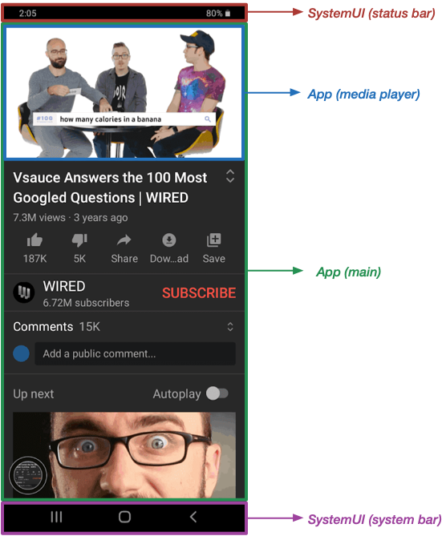

<a name="index">**目录**</a>

- <a href="#ch1">**1 一个全屏帧的构成**</a>

<br>
<br>

### <a name="ch1">1 一个全屏帧的构成</a><a style="float:right;text-decoration:none;" href="#index">[Top]</a>

当我们点亮手机屏幕，看到的某一时刻的全屏画面就是一个 **全屏帧**。根据 [framebuffer和Vsync](https://github.com/huanzhiyazi/articles/issues/28) 的分析，理论上来说，一个全屏帧可以是 framebuffer 中的一帧数据，但在 Android 实现中（也包括在很多其它计算机设备的实现中），因为采用了图像硬件合成技术来提高帧合成效率，往往在 framebuffer 中取到的并不是完整的全屏帧，我们在后文将有更详细的原理分析。

从微观来讲，一个全屏帧的构成就是一个个的像素值，所以理论上来讲，最简单的办法就是由一个进程或服务搜集一屏画面的所有图像数据构成一帧即可。但是我们知道一个全屏界面是由不同的进程来提供的，如图所示：



这是一个视频播放器的界面，整个界面包含：状态栏（status bar）、系统导航栏栏（system bar）、APP主窗口（window）、视频播放窗口（media player）4 个部分，每个部分的界面都是独立渲染的，其中 status bar 和 system bar 都属于 SystemUI进程，window 属于 APP进程，media player可以属于 APP进程也可以有自己独立的进程。可见一个进程既可以独立渲染一个界面，也可以包含多个渲染源，每个源独立渲染一个界面。

总之，一个全屏帧是由不同的渲染源构成的，即先由各自渲染源独立生成部分帧，然后再通过一个合成服务将所有部分帧合成一个完整的全屏帧。

我们约定，由一个或多个渲染源生成的图像数据叫 **部分帧**，把多个部分帧合成的图像数据叫 **合成帧**，把所有部分帧合成的最终图像数据叫 **全屏帧**。显然，一个合成帧既可能是部分帧也可能是全屏帧；一个部分帧可能是一个独立渲染源生成的部分帧，也可能是一个合成帧，也可能是一个全屏帧。三者的集合关系为：

```
部分帧 ⊆ 合成帧 ⊆ 全屏帧
```

接下来分别简要介绍一下参与帧生成、合成和显示的各个组件，这些组件包括：部分帧渲染源——Surface、帧合成服务——SurfaceFlinger、部分帧缓冲队列——BufferQueue、Android 硬件抽象层 HAL 以及两个重要的 HAL 模块，接下来讲解一下各个模块之间的关系和交互流程，这样结合 [framebuffer和Vsync](https://github.com/huanzhiyazi/articles/issues/28)，整个 Android 的显示系统原理就呼之欲出了。

<br>
<br>

### <a name="ch2">2 部分帧渲染源——Surface</a><a style="float:right;text-decoration:none;" href="#index">[Top]</a>

在 Android 中，负责生成部分帧的接口叫 Surface，在应用层（java）和本地层（c/c++）中都有相应的实现。从逻辑上讲，可以把 Surface 当做一个窗口，所以它通常也叫本地窗口。比如，我们在 APP 中看到的渲染的主界面就是一个 Surface，我们看到的顶部状态栏是一个 Surface，底部系统导航栏也是一个 Surface。

一个 Surface 的主要作用如下：

1. 负责管理一个窗口的各种属性，比如宽高、标志位、密度、格式（RGB颜色格式等）等。
2. 提供画布工具，用于绘制图像，生成部分帧数据，比如我们通常的布局界面绘制用到了基于 Skia 的画布工具。图像数据还可以采用 OpenGL 绘制或者是视频解码器（通常由另一个接口 SurfaceView 实现）。
3. 向帧缓冲队列（由合成服务提供）申请部分帧缓冲区，并将绘制好的图像数据写入部分帧缓冲区中。
4. 将写好的部分帧缓冲区插入帧缓冲队列，等待帧合成服务读取。

Surface 是一个 Binder 客户端，其对应的 Binder 服务端就是帧合成服务 SurfaceFlinger（虽然在具体实现上与 Surface 直接对接的并不是 SurfaceFlinger，但是不影响在原理上这么理解，我们可以理解为在 Surface 和 SurfaceFlinger 之间还有若干代理服务器）。

<br>
<br>

### <a name="ch3">3 帧合成服务——SurfaceFlinger</a><a style="float:right;text-decoration:none;" href="#index">[Top]</a>

既然 SurfaceFlinger 的作用是提供帧的合成服务，那么在逻辑上，SurfaceFlinger 也会提供一个本地窗口，这个本地窗口承载的是所有部分帧的合成帧，即全屏帧，这个本地窗口的名字叫 FramebufferNativeWindow（本文简称 FNWindow），这是 FNWindow 与 Surface 的不同之处。相同是，因为都表示一个窗口，所以会有相似的表现形式，这体现在 Surface 和 FNWindow 在本地层都继承了相同的类——ANativeWindow。我们来看看一个本地窗口应该具备哪些属性和功能：

*[/frameworks/native/libs/nativewindow/include/system/window.h](http://aospxref.com/android-11.0.0_r21/xref/frameworks/native/libs/nativewindow/include/system/window.h)*
```c
// ...
struct ANativeWindow
{
    // 本地窗口属性
    const uint32_t flags;
    const int   minSwapInterval;
    const int   maxSwapInterval;
    const float xdpi;
    const float ydpi;
    intptr_t    oem[4];

    // 本地窗口功能
    int     (*setSwapInterval)(struct ANativeWindow* window, int interval);
    int     (*query)(const struct ANativeWindow* window, int what, int* value);
    int     (*perform)(struct ANativeWindow* window, int operation, ... );
    int     (*dequeueBuffer)(struct ANativeWindow* window, struct ANativeWindowBuffer** buffer, int* fenceFd);
    int     (*queueBuffer)(struct ANativeWindow* window, struct ANativeWindowBuffer* buffer, int fenceFd);
    int     (*cancelBuffer)(struct ANativeWindow* window, struct ANativeWindowBuffer* buffer, int fenceFd);
}
// ...
```

可以看到，本地窗口的属性包括：

- 与 surface 状态相关的标记
- 支持的图像缓冲区数据交换间隔
- 像素密度
- 给原始设备制造商（OEM）保留的定制驱动空间（这表示如高通、联发科这样的 OEM 是可以根据其硬件需要对本地窗口进行适当的定制的）


