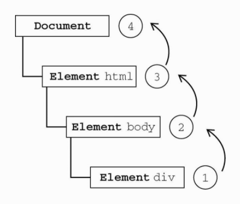
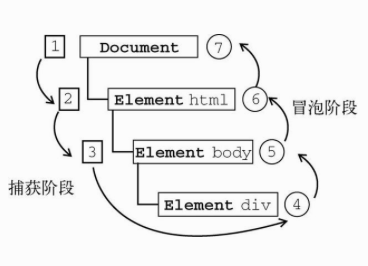

<a name="index">**目录**</a>

- <a href="#ch1">**1 两种事件流**</a>
    * <a href="#ch1.1">1.1 事件冒泡</a>
    * <a href="#ch1.2">1.2 事件捕获</a>
- <a href="#ch2">**2 DOM2 规范**</a>
- <a href="#ch3">**3 事件拦截**</a>
- <a href="#ch4">**4 与 Android 触摸事件比较**</a>

<br>
<br>

### <a name="ch1">1 两种事件流</a><a style="float:right;text-decoration:none;" href="#index">[Top]</a>

因为历史原因，Web 的很多标准都是厂商竞争的产物，浏览器事件标准也不例外。所谓 **事件流** 是指事件在 DOM 树中传递的顺序。现代浏览器支持两种类型的事件流：一是自底向上传递事件的 **事件冒泡**，由 IE 最先支持；二是自顶向下传递事件的 **事件捕获**，由 Netscape 最先提出。

尽管支持不同的事件传递方式，两种事件流都遵循同一个事件交互模型：一个屏幕区域内发生的事件，不仅仅是区域内的一个目标 DOM 能够进行处理，而是 DOM 树中凡是落在指定区域内的节点都有机会得到处理。

#### <a name="ch1.1">1.1 事件冒泡</a>

事件冒泡的原理是，事件首先由 DOM 树的叶子节点进行处理，然后依次将事件向上传递给父节点，直至 document 甚至 window。事件冒泡过程如下：




#### <a name="ch1.2">1.2 事件捕获</a>

事件捕获和事件冒泡正好相反，事件首先从 DOM 树根节点出发，然后自顶向下将事件逐层往下传递，直至叶子节点。每层的节点都有机会对该事件进行处理。其传递过程如下：


<br>
<br>

### <a name="ch2">2 DOM2规范</a><a style="float:right;text-decoration:none;" href="#index">[Top]</a>

现代的大多数浏览器都支持 DOM2 级规范。在该规范中规定，事件流既支持事件冒泡也支持事件捕获，一个事件产生后要经历三个阶段：事件捕获、处于目标、事件冒泡。如下图所示：



在通过 addEventListener(event, listener, cap) 注册事件时，每个节点，不论是捕获阶段还是冒泡阶段，都可以对事件进行处理（若要在捕获阶段进行处理， cap 参数必须为 true）。而如果是通过 `<div onclick=""/>` 来处理事件时，只能在冒泡阶段处理事件。

<br>
<br>

### <a name="ch3">3 事件拦截</a><a style="float:right;text-decoration:none;" href="#index">[Top]</a>

一个事件在传递过程中，是可以被拦截的。一旦被拦截，该事件流就被中断了，当前事件将不再继续被后续节点捕获和冒泡。事件拦截在事件处理程序中被执行，即当目标节点处理事件时发生：

```js
dom.addEventListener("click", function(event) {
    event.stopPropagation(); // 事件在捕获阶段被拦截
    // ...
}, true)
```

事件拦截针对父节点的某些操作来说非常有用。比如一个可以根据手势移动的容器，其中有很多子元素，如果希望手指可以拖动整个容器而不误操作容器内的元素，就需要在容器的事件处理程序中针对 touch 事件在捕获阶段进行拦截。

<br>
<br>

### <a name="ch4">4 与 Android 触摸事件比较</a><a style="float:right;text-decoration:none;" href="#index">[Top]</a>

虽然 [Android 触摸事件分发](https://github.com/huanzhiyazi/articles/issues/22) 在表现上要比浏览器事件分发更加复杂，不过两者有相似的事件分发模型：

- 事件在视图树传递过程中，都支持既被父节点处理，也被子节点处理。
- 都支持事件捕获和冒泡。
- 都支持事件拦截。

Android 事件与浏览器事件分发最大的不同是 Android 事件是一次性资源，而浏览器事件是可重复使用的资源，具体表现在：

- 默认情况下，一个事件在 Android 中的传递只能被一个节点消费，即事件是独占的；而在浏览器中事件是共享的，只要事件不被拦截，在事件流经过的每个节点都可以被重复消费。Android 独占事件的机制可以在复杂事件交互中减少事件冲突的可能。
- Android 的事件捕获和冒泡过程与浏览器大有不同。事件在捕获阶段一旦被消费，冒泡阶段不再处理该事件；只有捕获阶段没有任何节点消费事件时，冒泡阶段才可能消费事件。
- Android 事件拦截只在捕获阶段才会发生，容器节点如果想要消费一个事件，必须先进行拦截或者后代节点都不消费该事件。而叶子节点若要消费事件，其所有的前代容器节点都不能拦截该事件。


