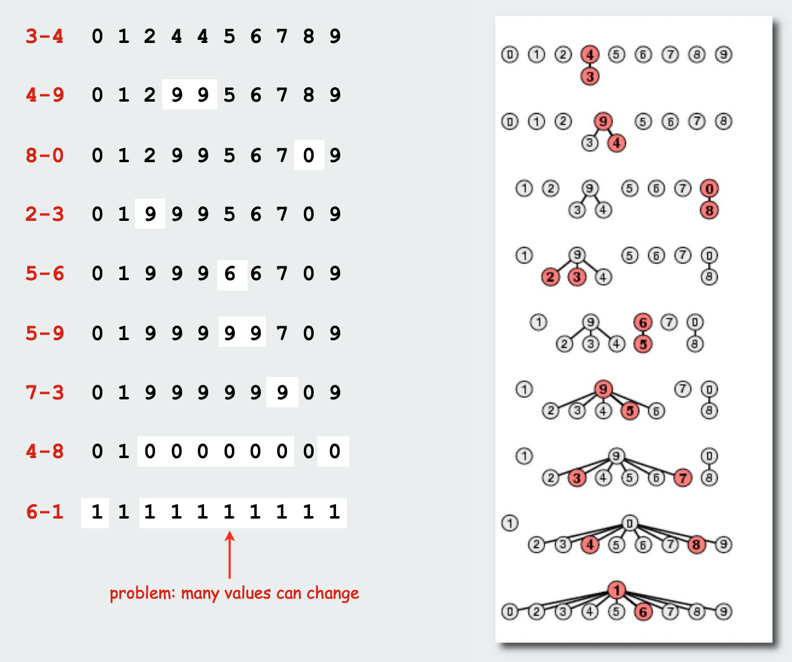
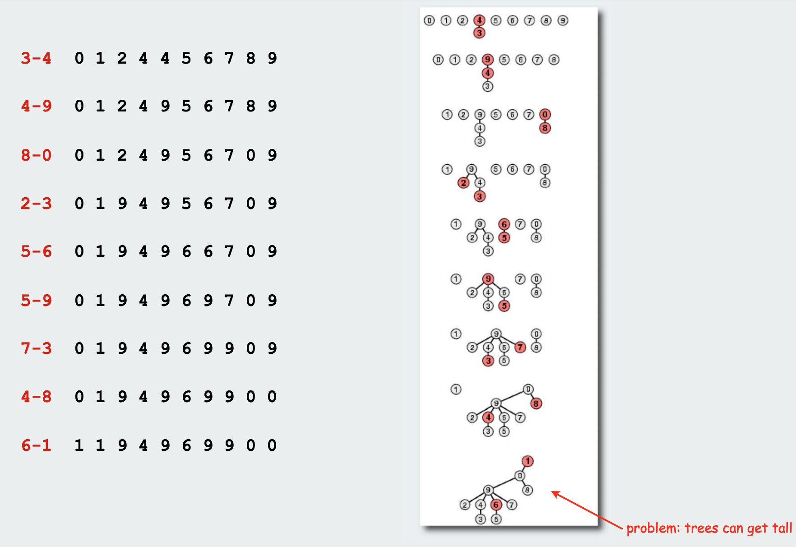
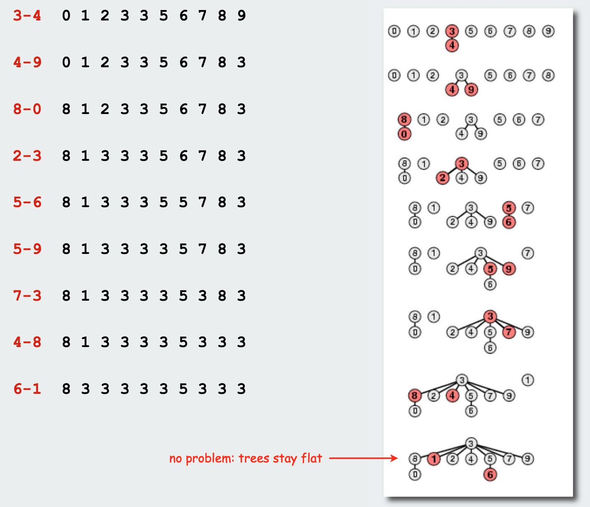
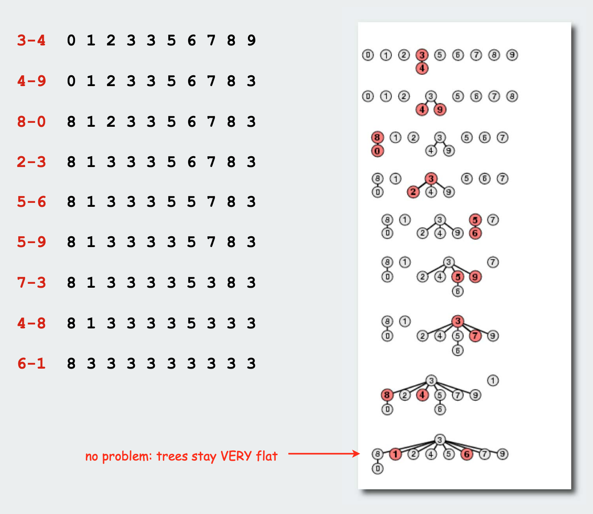
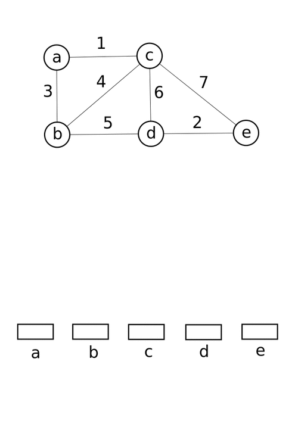

<a name="index">**目录**</a>

- <a href="#ch1">**1 问题抽象**</a>
- <a href="#ch2">**2 Union-Find 的实现**</a>
    * <a href="#ch2.1">2.1 快查找（quick find）实现</a>
    * <a href="#ch2.2">2.2 快合并（quick union）实现</a>
- <a href="#ch3">**3 Union-Find 的优化**</a>
    * <a href="#ch3.1">3.1 基于权重的优化</a>
    * <a href="#ch3.2">3.2 路径压缩优化</a>
- <a href="#ch4">**4 Union-Find 的应用**</a>

<br>
<br>

### <a name="ch1">1 问题抽象</a><a style="float:right;text-decoration:none;" href="#index">[Top]</a>

很多算法问题都可以抽象为这样一个结构：**有 N 个元素，每个元素都属于一个独立的集合中，集合与集合之间是互斥的，即每个元素不可能既属于集合 A 又属于集合 B**。

我们将这样的结构称之为 **Union-Find** 或者 **Disjoint-Set（不相交集合）**，以下简称 UF。

Union-Find 有 3 个主要的操作：

1. **UF(N)**：建立一个新的 UF 集合，初始化每个元素是一个集合。
2. **union(p, q)**：将元素 p 所在集合和元素 q 所在集合合并成一个集合。
3. **find(p)**：每个集合都会选举其中一个元素作为该集合的代表，find 操作返回元素 p 所在集合的代表。

UF 的一个典型应用是，判断一个网络中，任意两个节点的连通性问题。

一个例子：

- 初始集合如下：

```
root:   0     1     2     3     4     5     6     7     8     9
sets: { 0 } { 1 } { 2 } { 3 } { 4 } { 5 } { 6 } { 7 } { 8 } { 9 }
```

- 一系列 union 操作之后：

```
root:   0     1       2        5      7      4   
sets: { 0 } { 1 } { 2 3 9 } { 5 6 } { 7 } { 4 8 }
```

- find(2) = find(9) = 2，find(5) = 6，所以，元素 2 和 9 在同一个集合，但和元素 5 所在集合不相交。

- 执行 union(3, 8) 之后：

```
root:   0     1         2          5      7       
sets: { 0 } { 1 } { 2 3 4 8 9 } { 5 6 } { 7 }
```

<br>
<br>

### <a name="ch2">2 Union-Find 的实现</a><a style="float:right;text-decoration:none;" href="#index">[Top]</a>

简单起见，我们将 UF 结构化如下：

- 用一个整型数组 `id[]` 来表示 UF 的所有不相交集。
- `id[]` 的索引唯一标识一个元素。
- 数组 `id[]` 的每个索引 i 的值表示元素 i 的双亲元素，即 `i.parent = id[i]`，这表示 i.parent 和 i 是直连的，并规定，若 `id[i] = i` 则 i 是其所在集合的代表，或者说以当前集合树中的根节点作为当前集合的代表。

#### <a name="ch2.1">2.1 快查找（quick find）实现</a>

快查找的原理是：**如果元素 p 和 q 同属一个集合，则必有 `id[p] = id[q]`**。

代码如下：

```java
public class UF {
    private int[] id;

    public UF(int N) {
        id = new int[N];
        for (int i = 0; i < N; i++)
            id[i] = i;
    }

    // 快查找
    public int find(int p) {
        return id[p];
    }

    public void union(int p, int q) {
        int pid = id[p];
        for (int i = 0; i < id.length; i++)
            if (id[i] == pid) id[i] = id[q];
    }
}
```

可以看到，用快查找方法实现 UF，find 操作最快，只有 O(1) 时间复杂度；但是因为要维持同集合内的所有元素的父节点即根节点即代表元素这个关系不变，相应地增加了 union 操作的时间复杂度——O(N)。在 N 很大的时候，find 和 union 平均花费的时间太多。

一个快查找的合并图示如下：



不难发现，在快查找中，集合的树状表示可以让树是绝对扁平的，这是 find 操作只需要常量时间复杂度的根本原因。


#### <a name="ch2.2">2.2 快合并（quick union）实现</a>

快合并的原理是：**执行 union 操作时，将第二个元素代表（根）作为第一个元素代表的双亲，或者反过来**。这样执行合并操作后，第二个元素代表将成为合并集合的代表。

代码如下：

```java
public class UF {
    private int[] id;

    public UF(int N) {
        id = new int[N];
        for (int i = 0; i < N; i++)
            id[i] = i;
    }

    public int find(int p) {
        while (p != id[p]) p = id[p];
        return p;
    }

    // 快合并
    public void union(int p, int q) {
        int i = find(p);
        int j = find(q);
        id[i] = j;
    }
}
```

在快合并中，union 操作比起快查找来说，其渐进时间复杂度并没有更快，仍然是 O(N)，只是减少了常量倍数。而 find 操作所需时间复杂度也与 N 有关，在最坏情况下也需要 O(N)。

快合并图示如下：



从图示可以发现，在快合并方法中，随着合并操作的增加，会让集合树变得越来越高，越往后，其 find 和 union 操作需要的时间越多。

<br>
<br>

### <a name="ch3">3 Union-Find 的优化</a><a style="float:right;text-decoration:none;" href="#index">[Top]</a>

从上一节的 UF 实现来看，为了优化 UF 操作的时间复杂度，必须做到两点：

1. 设法让集合树变得更扁平。
2. 集合树的高度不能是 find 和 union 操作次数的递增函数。

进而可以思考，看看能不能在 find 和 union 操作的过程中，不断的用较小的代价调整集合树的高度？

#### <a name="ch3.1">3.1 基于权重的优化</a>

基于权重优化的原理：**记录每个集合的权重，权重一般为集合中元素个数（size）或者生成该集合执行的合并操作次数——秩（rank），执行 union 操作时，将小权重的集合合并到大权重集合中**。

该优化以快合并实现作为基础，修改其 union 操作如下即可：

```java
public class UF {
    private int[] id;
    private int[] sz;

    public UF(int N) {
        id = new int[N];
        sz = new int[N];
        for (int i = 0; i < N; i++) {
            id[i] = i;
            sz[i] = 1;
        }
    }

    public int find(int p) {
        while (p != id[p]) p = id[p];
        return p;
    }

    // 基于权重的优化
    public void union(int p, int q) {
        int i = find(p);
        int j = find(q);
        if (sz[i] < sz[j]) {
            id[i] = j;
            sz[j] += sz[i];
        } else {
            id[j] = i;
            sz[i] += sz[j];
        }
    }
}
```

在上一节的快合并实现中，可以发现，生成一个集合执行的 union 操作越多，该集合中的元素自然越多，即权重越大，其集合树的高度越高的概率就越大（在一些极端的合并顺序下，高度也可能不怎么变化）。考虑到这一特性，将权重小的集合树合并到权重大的集合树中，可以尽可能地减小合并集合树高度增长的速度。

基于权重优化的图示如下：



可以看到，与单纯快合并相比，优化后的集合树基本是扁平的。可以不太严谨地想象，基于权重优化的集合树总是会接近保持平衡，而一个有 N 个节点的平衡数的高度为 lgN。实际上，基于权重优化的 UF 操作（union 和 find）的时间复杂度就是 O(lgN)。

#### <a name="ch3.2">3.2 路径压缩优化</a>

路径压缩优化的原理：**在 find 操作中，从节点回溯到根节点的过程是一条路径探索，在路径探索中，不断将路径长度缩短的过程就是路径压缩**。

**缩短路径长度的通常方法是：对遇到的每个节点，改变其双亲节点的指向，变为指向其祖父节点**。

可以与 3.1 节基于权重的优化相结合，其代码如下：

```java
public class UF {
    private int[] id;
    private int[] sz;

    public UF(int N) {
        id = new int[N];
        sz = new int[N];
        for (int i = 0; i < N; i++) {
            id[i] = i;
            sz[i] = 1;
        }
    }

    // 路径压缩优化
    public int find(int p) {
        while (p != id[p]) {
            id[p] = id[id[p]];
            p = id[p];
        }
        return p;
    }

    public void union(int p, int q) {
        int i = find(p);
        int j = find(q);
        if (sz[i] < sz[j]) {
            id[i] = j;
            sz[j] += sz[i];
        } else {
            id[j] = i;
            sz[i] += sz[j];
        }
    }
}
```

路径压缩优化进一步减小了集合树的高度，在路径压缩的同时也加速了 find 操作的过程。优化之后 M 个 union 或 find 操作的总时间复杂度为 O(M𝛂(N))，其中 𝛂(N)<5 接近一个常量。所以每个操作接近于常量时间复杂度（证明比较复杂，有时间再展开）。

路径压缩图示如下：



<br>
<br>

### <a name="ch4">4 Union-Find 的应用</a><a style="float:right;text-decoration:none;" href="#index">[Top]</a>

UF 的应用有很多，除了文章开始介绍的判断网络节点连通性问题以外，这里再介绍一个应用：**Kruskal 最小生成树算法**。

Kruskal 算法解决的问题是，在一个带权连通无向图中，寻找一棵覆盖所有节点的树（无环），该树是所有满足前述条件树中权重和最小的。所以最小生成树实际是最小权重生成树。

假设一个带权连通无向图 G，有 N 个节点，E 条边，每条边都有一个权重。我们可以用 UF 来产生一棵最小生成树，其步骤如下：

1. 初始化一个规模为 N 的 UF。
2. 对 E 条边按照权重值从小到大进行排序，生成一个序列 elist。
3. 遍历 elist，对于每条边 ei=(vi, ui)，若 find(vi)=find(ui)，说明顶点 vi 和 ui 在一个集合中，即在已经生成的树中，若加入到生成树集合 T 中将生成环，所以不用管继续往下遍历；否则，执行 union(vi, ui)，并将 ei 加入生成树集合 T 中。

遍历完 elist 之后，由 T 中的边组成的就是一棵最小生成树。可以看到，UF 在改算法中充当着消除环的作用。其时间复杂度为 O(N + lgE)。

以下为 UF 实现 Kruskal 算法的演示过程：




